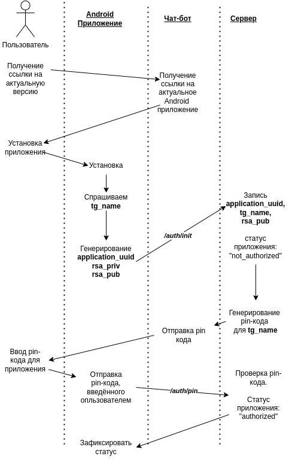

# Авторизация 

Процедура авторизации: 

По шагам:
1. Пользователь пишет боту, бот запоминает пользователя
2. (Опционально) Бот высылает ссылку на приложение.
3. Пользователь устанавливает приложение
4. Приложение спрашивате имя в телеграмме (`tg_name`)
5. Приложение генерирует:
   1. `application_uuid` -- уникальный UUID приложения
   2. `rsa_priv`, `rsa_pub` -- приватный и публичный ключи ассиметрической криптографии для подпими. RSA
6. Отправка запроса `/auth/init/` на сервер
7. Сервера записывает `application_uuid` и `rsa_pub` в базу данных. Ставит статус `not_authorized`
8. Отправка через Telegram-бот pin кода
9. Пользователь вводит pin в приложении. Всего 3 попытки
10. Сервер устанавливает статус `authoirized`

Данную процедуру нужно делать только один раз при установке

Возможно несколько приложений на разных устройствах у одного пользователя.

Приватный ключ хранится на телефоне и используется для подписми своих действий.

Публичный ключ хранится и на телефоне и на сервере. 
Сервер может проверить подпись каждого действия клиента.