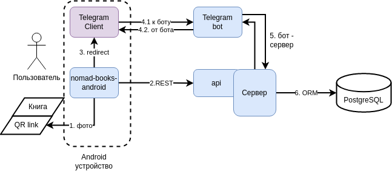

# C1 архитектура

**UPDATE 16.12.2023**

ЭТА СТРАНИЦА УСТАРЕЛА.

--------

------

## Схема
Общая схема

### Описание схемы

Пользователь владеет книгами, 
каждая из которых имеет уникальный QR код, дающий ссылку на 
описание книги.
(Важно: **каждый** экземпляр одной книги имеет уникальный QR код)

На смартфоре пользователя установлено:
1. Стандартный Telegram Client
2. Приложение *nomad-books-android* (далее просто *приложение*)

Внешняя часть состоит из:
1. Telegram bot-а
2. Сервера
    1. доступ к серверу через REST API
3. ORM Базы даннных (Postgre SQL)

### Описание взаимодействий

1. QR код можно сфотографировать, извлечь ссылку и через *приложение* просмотреть описание книги, присвоить статус к книге, поменять владельца и т.д.
2. С помощью REST API происходит взаимодействие межлду приложением и сервером
3. Получая информацию о владельце книги, можно редирекнтнуть и перейти к общению с владельцем в Telegram
4. Общение с ботом осуществляется через стандартные протоколы Telegram
5. Бот находится в доверенной среде, поэтому взаимодействие происходит без проверки.
6. ORM база данных для сущностей сервера

## User Case

См. [uc.md](uc.md)